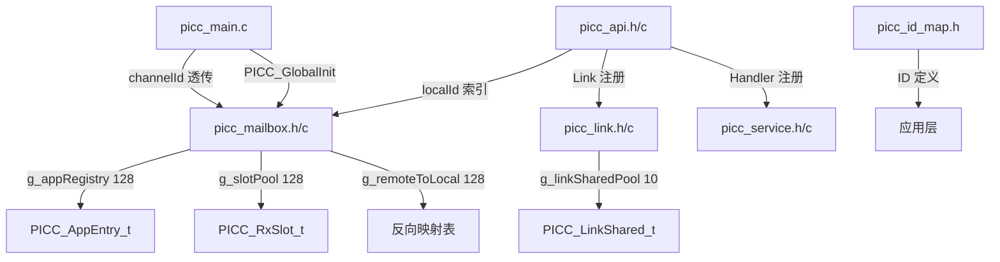

## 用户需求

根据 PICC 架构重构 v5（Final）方案，对 PICC 核间通信中间件进行重构，主要变更：

### 核心功能

- 将 `PICC_AppIndex_e` 枚举（0~9 数组索引）替换为 `uint8 localId`（1~127 直接索引），实现 O(1) 查找
- 重构 mailbox 数据结构：`PICC_AppContext_t[10]` + `PICC_RxMailbox_t[10]` → `PICC_AppEntry_t[128]` + 全局 `g_slotPool[128]`（按需分配）
- 新增 `g_remoteToLocal[128]` 反向映射表，修复 Event 路由 bug
- `PICC_StoreToMailbox` 增加 `channelId` 参数做防御校验
- Link 层改为共享池 `PICC_LinkShared_t[10]`，按 `(remoteId, channelId)` 去重共享；Server 角色不分配 Link 池
- `PICC_AppEntry_t` 字段重排（uint8 在前、uint16 在后），确保自然对齐
- `PICC_Init()` 删除 `appIndex` 参数，增加 ID 范围检查和重复注册检测
- 新增 `PICC_GlobalInit()` 在 `PICC_InfraInit()` 内部调用
- 新增 `picc_id_map.h` 统一管理所有 APP 的 LOCAL/REMOTE ID
- Service handler 扩容到 24
- 诊断数组扩容到 `uint8[128]`

### 约束条件

- 仅可修改 `SWC/PICC/Picc_Deamon/` 和 `SWC/Pwsm/`, `SWC/Hm/`, `SWC/DM/`, `SWC/Soa_Adapter/` 中的应用文件
- 不可修改 `generate/`, `FreeRTOS/Source/`, `RTD/`, `board/` 目录
- RAM 增量控制在 ~500B 以内（v5 评估约 +300B）
- 必须保证无语法错误、无数组溢出

## 技术栈

- 语言: C (Embedded, ARM Cortex-M7, S32G399A)
- 编译器: Green Hills (GHS) / GCC
- RTOS: FreeRTOS
- 硬件: S32G399A M7 Core, IPCF 共享内存通道
- 编码规范: MISRA-C 风格, uint8/uint16/sint8/boolean 基础类型

## 实现策略

采用"由内向外"的修改顺序：先修改底层核心数据结构（mailbox），再修改依赖层（link, service, api, main），最后修改应用层。所有 PICC Daemon 内部文件的修改需在同一个实施批次内完成，确保编译依赖一致。

关键设计决策：

1. **localId 直接索引**: `g_appRegistry[localId]`，localId 取值 1~127，0 和 128~255 为无效值。ID 范围检查在 PICC_Init 入口完成。
2. **全局 Slot 池按需分配**: 每次 PICC_Init 根据配置的 methodSlots/responseSlots/eventSlots 连续分配 g_slotPool 区间，由 g_slotPoolNextFree 追踪。
3. **共享 Link 池**: 同一 `(remoteId, channelId)` 的多个 Client 复用同一 Link 上下文，refCount 引用计数。Server 角色设 `linkSharedIdx=0xFF` 跳过分配。
4. **Event 路由修复**: 使用 `g_remoteToLocal[providerId]` 反向映射查找 localId，替代原 PICC_FindAppByRemoteId 线性扫描；channelId 防御校验防止消息错投通道。

## 实现注意事项

- **对齐**: PICC_AppEntry_t 的 uint16 字段必须放在结构体后半段（offset 12~19），保证自然对齐
- **g_remoteToLocal 初始化**: 全部初始化为 0xFF（无效值），表示未映射
- **g_slotPool 分配**: PICC_Init 中累计分配，需检查 `(g_slotPoolNextFree + totalNeeded) > PICC_SLOT_POOL_SIZE` 防越界
- **channelId 透传**: PICC_StoreToMailbox 和 PICC_StoreCallbackResult 都需要新增 channelId 参数，从 PICC_ProcessSingleMessage 传入
- **诊断数组**: `PICC_ChannelDiag_t.appLinkState` 从 `PICC_LinkState_e[PICC_APP_MAX=10]` 改为 `uint8[PICC_REGISTRY_SIZE=128]`，遍历时从 `PICC_APP_MAX` 改为 `PICC_REGISTRY_SIZE`
- **PICC_GlobalInit**: memset 清零 g_appRegistry/g_slotPool，memset(g_remoteToLocal, 0xFF) 清零映射表，g_slotPoolNextFree=0

## 架构设计



## 目录结构

```
SWC/PICC/Picc_Deamon/
├── picc_id_map.h              # [NEW] ID 分配表: PICC_ID_xxx_LOCAL / PICC_ID_xxx_REMOTE
├── picc_api.h                  # [MODIFY] 删除 PICC_AppIndex_e 枚举; 所有 API 签名 PICC_AppIndex_e→uint8; 新增 PICC_GlobalInit 声明; 新增 PICC_E_DUPLICATE/PICC_E_REMOTE_ID_CONFLICT; AppConfig 增加 methodSlots/responseSlots/eventSlots
├── picc_api.c                  # [MODIFY] PICC_Init 删除 appIndex 参数, 增加 ID 范围检查+重复注册检测; 所有 API 第一个参数 PICC_AppIndex_e→uint8; PICC_GlobalInit 实现
├── picc_mailbox.h              # [MODIFY] 接口全部 uint8; PICC_StoreToMailbox 增加 channelId; 新增 PICC_GlobalInit 声明; 删除 PICC_FindAppByLocalId/RemoteId 外部接口
├── picc_mailbox.c              # [MODIFY] 核心重构: g_appRegistry[128]+PICC_AppEntry_t(20B); g_slotPool[128]全局池+g_slotPoolNextFree; g_remoteToLocal[128]; 路由逻辑修复(反向映射+channelId校验); 删除旧 g_appContexts/g_rxMailbox/PICC_RxMailbox_t
├── picc_link.h                 # [MODIFY] 新增 PICC_LinkShared_t(含 refCount/config/state/isInitialized/periodCounter/backoffCounter); PICC_LINK_SHARED_POOL_SIZE=10; PICC_LinkRegisterShared 接口
├── picc_link.c                 # [MODIFY] g_linkSharedPool[10] 替换 g_linkContexts[10]; 共享查找+refCount; Server 角色跳过 Link 分配(linkSharedIdx=0xFF); Client 按(remoteId,channelId)去重
├── picc_service.h              # [MODIFY] PICC_MAX_EVENT_HANDLERS 4→24; PICC_MAX_METHOD_HANDLERS 4→24
├── picc_main.c                 # [MODIFY] PICC_ChannelDiag_t.appLinkState 改 uint8[128]; PICC_DiagUpdateLinkState 遍历 PICC_REGISTRY_SIZE; PICC_StoreToMailbox 传入 channelId; PICC_InfraInit 内调用 PICC_GlobalInit
├── picc_main.h                 # [MODIFY] 包含 picc_id_map.h 或保持不变(视应用层引用需求)

SWC/Pwsm/pwsm.c                 # [MODIFY] PICC_APP_PWR→PICC_ID_PWR_LOCAL; PICC_APP_DIAG→PICC_ID_DM_LOCAL; PICC_Init 删除第一参数; 所有 API 第一个参数改 localId
SWC/Hm/hm.c                     # [MODIFY] PICC_APP_HEALTH→PICC_ID_HEALTH_HB_LOCAL; PICC_APP_RSV1→PICC_ID_HEALTH_RPT_LOCAL; 同上签名变更
SWC/DM/diag_mgmt.c              # [MODIFY] PICC_APP_RSV0→PICC_ID_DIAGMGMT_LOCAL; 同上签名变更
SWC/Soa_Adapter/soa_adapter_main.c  # [MODIFY] PICC_APP_SOA→PICC_ID_SOA_LOCAL; 同上签名变更
```

## 关键代码结构

```c
/* picc_mailbox.c - 核心新数据结构 */
#define PICC_REGISTRY_SIZE    (128U)
#define PICC_SLOT_POOL_SIZE   (128U)
#define PICC_RX_MAX_DATA_LEN  (32U)
#define PICC_DEFAULT_SLOTS    (2U)

typedef struct {
    /* uint8 fields (offset 0~11) */
    uint8    isRegistered;
    uint8    remoteId;
    uint8    role;
    uint8    channelId;
    uint8    methodSlotCount;
    uint8    responseSlotCount;
    uint8    eventSlotCount;
    uint8    methodVictim;
    uint8    responseVictim;
    uint8    eventVictim;
    uint8    linkSharedIdx;       /* 0xFF=未分配 */
    uint8    _pad;
    /* uint16 fields (offset 12~19) — 自然对齐 */
    uint16   linkReqPeriodMs;
    uint16   methodSlotStart;
    uint16   responseSlotStart;
    uint16   eventSlotStart;
} PICC_AppEntry_t;  /* Total: 20B */

static PICC_AppEntry_t  g_appRegistry[PICC_REGISTRY_SIZE];  /* 128×20=2560B */
static PICC_RxSlot_t    g_slotPool[PICC_SLOT_POOL_SIZE];     /* 128×48=6144B */
static uint16           g_slotPoolNextFree;
static uint8            g_remoteToLocal[PICC_REGISTRY_SIZE]; /* 128B, init 0xFF */

/* picc_link.c - 共享 Link 池 */
#define PICC_LINK_SHARED_POOL_SIZE  (10U)

typedef struct {
    PICC_LinkConfig_t config;
    volatile PICC_LinkState_e state;
    uint8    isInitialized;
    uint16   periodCounter;
    uint8    backoffCounter;
    uint8    refCount;
} PICC_LinkShared_t;  /* ~28B */

static PICC_LinkShared_t g_linkSharedPool[PICC_LINK_SHARED_POOL_SIZE];

/* picc_api.h - AppConfig 扩展字段 */
typedef struct {
    uint8                    localId;
    uint8                    remoteId;
    PICC_Role_e              role;
    uint8                    channelId;
    uint16                   Client_linkReq_PeriodMs;
    PICC_MethodCallback_t    methodHandler;
    PICC_EventCallback_t     eventHandler;
    uint8                    methodSlots;     /* 0=默认2 */
    uint8                    responseSlots;   /* 0=默认2 */
    uint8                    eventSlots;      /* 0=默认2 */
} PICC_AppConfig_t;

/* picc_id_map.h - ID 定义 */
#define PICC_ID_PWR_LOCAL           (1U)
#define PICC_ID_PWR_REMOTE          (6U)
#define PICC_ID_DM_LOCAL            (2U)
#define PICC_ID_DM_REMOTE           (7U)
#define PICC_ID_HEALTH_HB_LOCAL     (21U)
#define PICC_ID_HEALTH_HB_REMOTE    (26U)
#define PICC_ID_DIAGMGMT_LOCAL     (52U)
#define PICC_ID_DIAGMGMT_REMOTE    (60U)
#define PICC_ID_SOA_LOCAL           (71U)
#define PICC_ID_SOA_REMOTE         (76U)
#define PICC_ID_HEALTH_RPT_LOCAL    (81U)
#define PICC_ID_HEALTH_RPT_REMOTE   (91U)
```