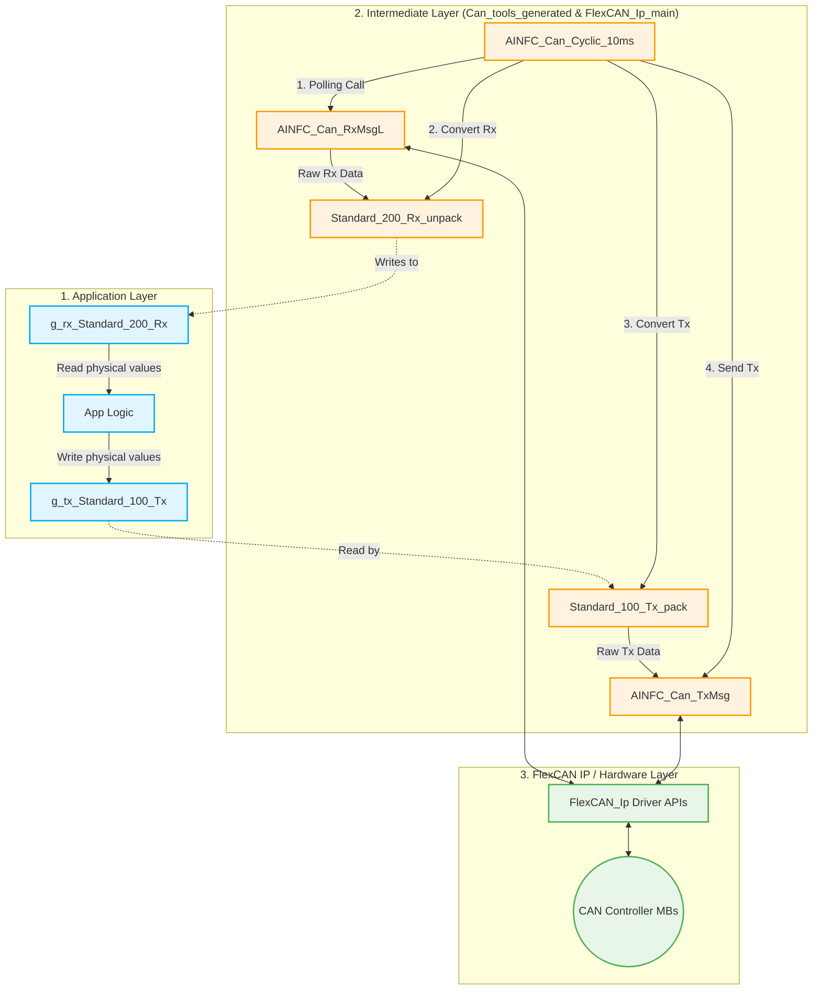
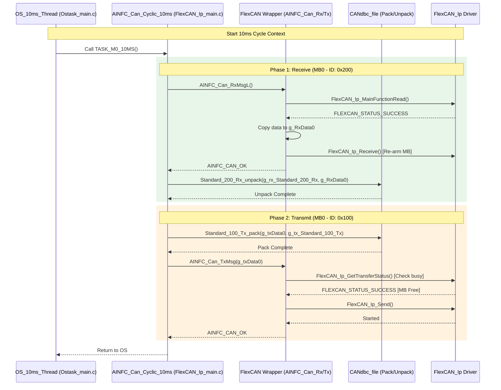

# CAN Module Architecture and Design

This document details the architectural design and functional calling relationships of the CAN communication module within the M-Core platform.

## 1. System Overview

The CAN module is responsible for handling cyclic transmission and reception of physical CAN messages. It bridges the Application Layer (where physical values are used) with the low-level hardware `FlexCAN_Ip` driver via generated DBC pack/unpack functions. 

The module is strictly driven by the centralized RTOS periodic task architecture, specifically running within the unified 10ms FreeRTOS thread.

## 2. Module Architecture

The architecture is divided into three distinct layers:
1. **Application Layer:** Sets and reads physical variables (e.g., Vehicle Speed, Battery, Gear) from globally exposed structures generated from DBC.
2. **Intermediate Packing/Unpacking Layer & Cyclic Dispatcher:** Maps physical variables to/from raw `uint8_t` byte sequences, implementing endianness and scaling conversions. The cyclic dispatcher (`AINFC_Can_Cyclic_10ms`) orchestrates this packing and interfaces with the underlying FlexCAN wrappers.
3. **Hardware Abstraction (FlexCAN IP):** Uses NXP RTD `FlexCAN_Ip` APIs to interact physically with the CAN controller's Message Buffers (MBs).

## 3. Cyclic Processing Walkthrough (10ms)

The core driver for the CAN module is the unified 10ms thread `OS_10ms` in `Ostask_main.c`. The processing follows a strict execution path executed every 10 milliseconds.

## 4. Key Components and Files

- **`Ostask_main.c / .h` (Task Management)**
  - Implements the FreeRTOS `OsTask_10ms_Thread`.
  - Agregates the calls within `TASK_M0_10MS()`, executing `AINFC_Can_Cyclic_10ms()` immediately at the start of the timeframe.

- **`FlexCAN_Ip_main.c / .h` (CAN Business Logic)**
  - Implements `AINFC_Can_Cyclic_10ms()` which handles cyclic polling.
  - Implements `AINFC_Can_TxMsg()` and `AINFC_Can_RxMsgL()` wrappers.
  - Manages internal states (`g_txBusy[]`, `g_rxConfigured[]`) and CAN Mailbox IDs assignment.

- **`CANdbc_file.c / .h` (Auto-Generated DBC Layer)**
  - Exposes globally available physical measurement structs: `g_tx_Standard_100_Tx` and `g_rx_Standard_200_Rx`.
  - Implements signal bit-masking, byte alignment, shifting, factor scaling, and endianness logic within the `_pack` and `_unpack` macros.

- **`NXP RTD FlexCAN_Ip` (Underlying Platform Code)**
  - Handles actual hardware registers, located in `RTD/src/FlexCAN_Ip.c` (Read-Only).
