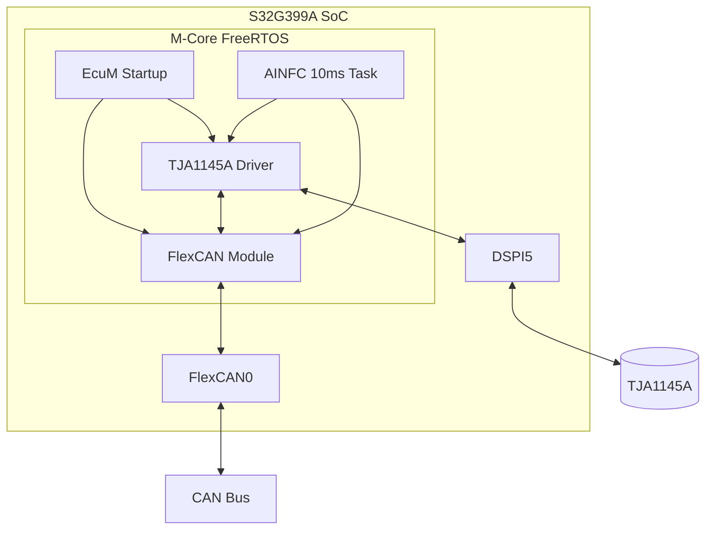
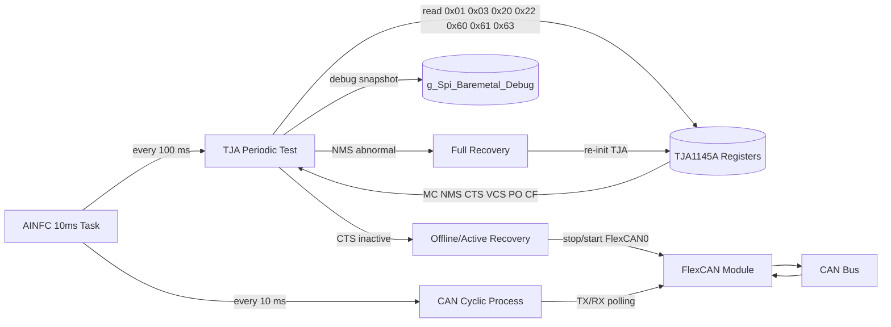
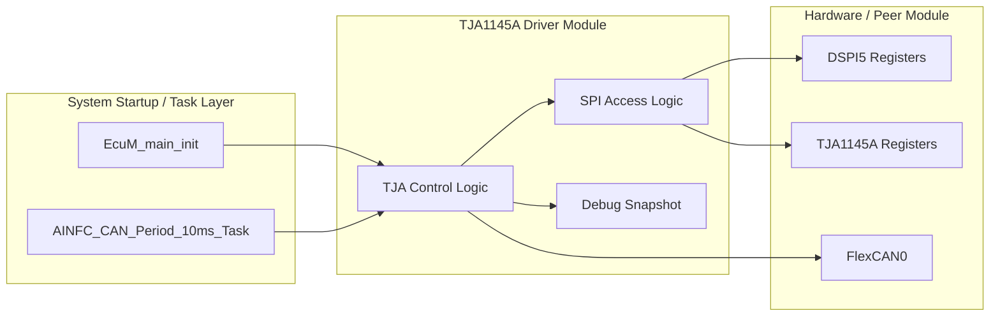
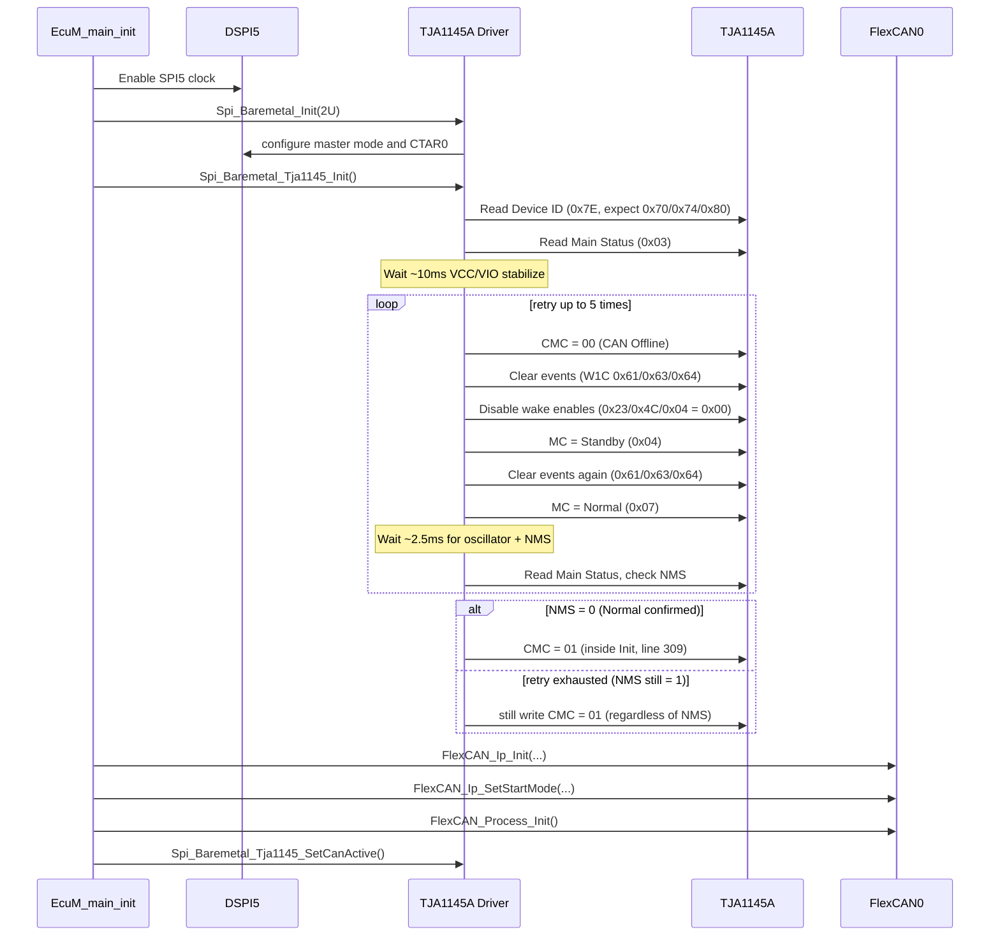
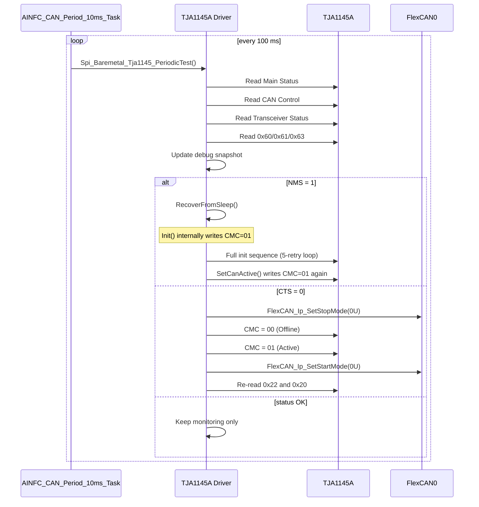
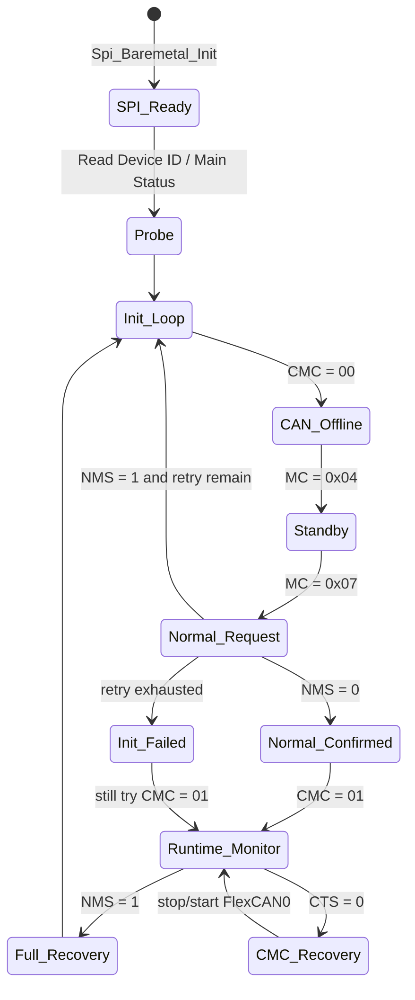

# TJA1145A Driver Software Design

> **Version**: 1.2  
> **Date**: 2026-03-12  
> **Scope**: S32G399A M7_0 current TJA1145A bare-metal driver design and integration behavior

---

## 1. 文档概述

本文档描述当前工程中 TJA1145A 驱动的实际设计方式。文档重点不是复述芯片手册全部内容，而是解释“当前代码到底怎么工作、为什么这么做、和 FlexCAN 是怎样配合的”。

文档采用自上而下的结构，先说明系统位置和整体流程，再下钻到 SPI 访问、寄存器策略和恢复逻辑。这样阅读时可以先建立整体印象，再进入实现细节。

### 1.1 阅读指引

| Chapter | Content | Target Audience |
| --- | --- | --- |
| Chapter 2 | File List | 所有读者，快速定位相关代码 |
| Chapter 3 | System Global View | 所有读者，先理解驱动在系统中的位置 |
| Chapter 4 | Module Architecture | 开发人员，理解模块边界和职责 |
| Chapter 5 | Core Process Design | 开发人员，理解初始化、监测、恢复主流程 |
| Chapter 6 | Module Detailed Design | 开发人员，查阅 SPI、寄存器和接口细节 |
| Chapter 7 | Integration and Constraints | 集成人员，关注和 FlexCAN 的配合与风险 |
| Chapter 8 | Appendix | 联调和维护人员，快速查关键寄存器 |

### 1.2 文档边界

本文档只覆盖当前工程里已经实现、或者被当前实现直接依赖的内容：

- DSPI5 对 TJA1145A 的 bare-metal 访问。
- 启动阶段的 TJA1145A 模式拉起流程。
- 运行期约 100 ms 一次的状态监测与恢复逻辑。
- 当前驱动与 FlexCAN0 的直接配合关系。

本文档不展开以下内容：

- TJA1145A 全量手册特性。
- selective wake-up 和 partial networking 的完整配置方案。
- 面向多实例、多控制器的通用化驱动框架设计。
- 产品化量产场景下的标准诊断架构。

---

## 2. File List

| File | Type | Description |
| --- | --- | --- |
| `TJA145A_Spi_Ip/TJA1145A_Spi_Baremetal.h` | Header | DSPI5 与 TJA1145A 的接口声明、关键寄存器和调试结构定义 |
| `TJA145A_Spi_Ip/TJA1145A_Spi_Baremetal.c` | Source | SPI 初始化、寄存器读写、TJA 初始化、恢复和周期检测主实现 |
| `src/Ecum_Init_Main/EcuM_main_init.c` | Source | 系统启动阶段对 SPI、TJA 和 FlexCAN 的调用入口 |
| `FlexCAN_Ip/FlexCAN_Ip_main.c` | Source | 10 ms 周期任务和 TJA 周期检测触发点 |
| `FlexCAN_Ip/FlexCAN_Ip_main.h` | Header | 当前 CAN 模块接口、MB 分配与业务定义 |
| `S32G3_reference_manual/TJA1145A.md` | Reference | TJA1145A 模式、寄存器和唤醒约束的手册依据 |

---

## 3. System Global View

### 3.1 System Positioning

这张图先回答一个最核心的问题：TJA1145A 驱动在系统里处于什么位置。

图中可以看到，当前设计不是把 TJA1145A 当成一个完全独立的底层设备，而是把它放在启动流程、周期任务和 FlexCAN 控制器之间一起协同工作。也就是说，它既承担“SPI 外设访问”的角色，也承担“CAN 收发器状态管理”的角色。

图中几条线需要特别注意：

1. `EcuM Startup -> TJA1145A Driver`
   - 表示启动阶段由系统初始化流程主动拉起 TJA1145A。
   - 这一步不是后台自动完成，而是由启动代码明确调用。

2. `TJA1145A Driver <-> DSPI5 <-> TJA1145A`
   - 表示所有模式切换和状态采集都依赖 DSPI5 完成寄存器访问。
   - 当前没有中间抽象层，驱动代码直接操作 DSPI5 寄存器。

3. `TJA1145A Driver <-> FlexCAN Module`
   - 表示当前恢复逻辑和 CAN 控制器存在直接耦合。
   - 当收发器 inactive 时，驱动会直接 stop/start FlexCAN0，而不是只返回错误给上层。

4. `AINFC 10ms Task -> TJA1145A Driver`
   - 表示运行期监测不是中断驱动，而是挂在周期任务中执行。
   - 当前工程里大约每 100 ms 检测一次收发器状态。

### 3.2 Runtime Data Flow

这张图描述的是运行期真正发生的数据流，而不是静态结构图。它强调两个事实：

- 第一，业务报文收发和 TJA 状态检测共用同一个周期任务上下文。
- 第二，当前恢复逻辑会反向影响 FlexCAN 模块，而不是局限在 TJA 驱动内部。

阅读这张图时，可以按下面顺序理解：

1. 左侧 `AINFC 10ms Task` 是统一入口。
   - 一条分支进入 `CAN Cyclic Process`，负责正常 TX/RX 业务。
   - 另一条分支周期性进入 `TJA Periodic Test`，负责状态检查。

2. 中间 `TJA Periodic Test <-> Registers` 表示监测函数会主动读取关键寄存器。
   - `Mode Control (0x01)` 用来确认当前写入的模式值。
   - `Main Status (0x03)` 用来判断是否仍处于 Normal。
   - `CAN Control (0x20)` 用来确认 CMC 当前值。
   - `Transceiver Status (0x22)` 用来判断收发器是否真正 active。
   - `System/Transceiver Event (0x60/0x61/0x63)` 用来做诊断观察。

3. `debug snapshot` 表示每次监测都会更新全局调试镜像。
   - 联调时可以直接看镜像，不用每次停机读真实寄存器。

4. `Full Recovery` 和 `Offline/Active Recovery` 是两类恢复动作。
   - 前者针对模式异常，动作更重，会重新走初始化主路径。
   - 后者针对 `CTS=0`，动作更轻，只重做 CAN Control 并协调 FlexCAN0。

---

## 4. Module Architecture

### 4.1 Layered Structure

这张图说明当前驱动内部实际上包含三块内容：控制逻辑、SPI 访问逻辑、调试可观测数据。

它不是严格意义上的“分层框架”，而是一个围绕单器件搭建的集成式模块。这样的好处是当前代码短、联调直接；代价是职责边界比较紧，后续若要扩展多实例或做平台化改造，重构成本会比较高。

图中三个内部块的含义如下：

1. `TJA Control Logic`
   - 负责初始化顺序、模式切换、周期检测和恢复决策。
   - 这是驱动真正的行为中心。

2. `SPI Access Logic`
   - 负责 DSPI5 初始化、单字节传输和寄存器读写封装。
   - 它为控制逻辑提供最基础的通信能力。

3. `Debug Snapshot`
   - 负责记录关键寄存器镜像、状态摘要和错误码。
   - 当前驱动为了方便调试，把这部分作为全局可见数据保留下来。

### 4.2 Module Responsibility Overview

| Area | Responsibility | Current Implementation Characteristic |
| --- | --- | --- |
| SPI Access | 初始化 DSPI5、执行 8-bit SPI 传输、拼接寄存器读写序列 | 轮询式、无 DMA、无中断、直接寄存器访问 |
| TJA Control | 初始化 TJA1145A、切换 Normal/Standby、设置 CAN Active | 面向当前单器件，流程直接写在一个源文件里 |
| Runtime Monitor | 周期读取状态寄存器，识别 `NMS` 和 `CTS` 异常 | 由 10 ms 任务按 100 ms 周期触发 |
| Recovery | 模式异常时全恢复，收发器 inactive 时轻量恢复 | 直接耦合 FlexCAN0 stop/start |
| Debug | 保存寄存器快照、错误码和供电相关状态摘要 | 便于 TRACE32 观测，但封装边界较弱 |

---

## 5. Core Process Design

### 5.1 Initialization Sequence

这张图是整份文档里最重要的一张图，因为它把“启动阶段到底做了什么”完整串起来了。

当前初始化可以分成两段理解：

1. 先把 SPI 通道准备好。
   - 如果 DSPI5 本身没有进入正确工作状态，后续所有寄存器访问都不成立。

2. 再把 TJA1145A 从不确定上电状态拉到当前软件可接受的工作状态（最多重试 5 次）。
   - 先强制 `CAN Offline`（CMC=00），目的是先收住总线侧行为。
   - 然后调用 `ClearEventsAndDisableWakeup()`，该函数会先 W1C 清除 0x61/0x63/0x64 三个事件寄存器，再将 0x23（Transceiver Event Enable）、0x4C（Wake Pin Enable）、0x04（System Event Enable）全部写 0x00 以关闭所有唤醒源。
   - 再走 `Standby -> Clear events again -> Normal` 的进入路径。

这里有一个必须明确写出来的实现特征：

- 当前代码判断初始化成功的核心条件是 `NMS=0`。
- 但是即使这个条件最终没有满足，函数退出前仍然会尝试把 `CAN Control` 写成 `0x01`。

这意味着“初始化返回失败”和“驱动仍尝试拉起 transceiver”这两件事在当前实现里是同时可能发生的，联调时不能只看一个返回值就判断链路已经完全不可用。

### 5.2 Runtime Monitoring and Recovery

这张图回答的是运行期三个问题：什么时候检查、检查什么、异常后怎么处理。

先看触发方式：

- 周期检测不在中断里做，而是在 CAN 周期任务里做。
- 当前任务 10 ms 执行一次，但 TJA 检测不是每 10 ms 都做，而是按更低频率大约 100 ms 执行一次。

再看检查内容：

- `Mode Control (0x01)` 读回当前模式值，记录到调试镜像供联调确认。
- `Main Status (0x03)` 主要看 `NMS`，判断芯片是否已经脱离 Normal。
- `CAN Control (0x20)` 读回 CMC 当前值，记录到调试镜像。
- `Transceiver Status (0x22)` 主要看 `CTS`，判断收发器是否真的 active。
- `0x60/0x61/0x63` 更多用于诊断观察（FSMS、VCS、PO、CF 计数和 supply status），不直接决定业务路径。

最后看恢复动作：

1. `NMS = 1`
   - 这被当成较重故障处理。
   - 当前策略是直接走全量恢复，相当于重新把 TJA 初始化一遍。

2. `CTS = 0`
   - 这被当成较轻故障处理。
   - 当前策略不是全重启，而是先让 FlexCAN0 stop，再把 `CMC` 从 Offline 拉回 Active，最后 restart FlexCAN0。

3. `status OK`
   - 只更新监测镜像，不额外做动作。

这也说明一个设计现实：当前驱动已经不只是“读写 TJA 寄存器”，它实际上承担了一部分链路恢复协调职责。

### 5.3 Software State Machine

这张图不是手册里的完整硬件状态机，而是“当前软件真正实现出来的状态机”。这一点必须区分清楚，否则很容易把芯片能力和代码行为混在一起。

理解这张图时，建议把它分成三个阶段：

1. 启动建链阶段
   - `SPI_Ready -> Probe -> Init_Loop`
   - 目标是证明 SPI 可用、器件可访问，并开始进入模式拉起流程。

2. 初始化确认阶段
   - `CAN_Offline -> Standby -> Normal_Request -> Normal_Confirmed`
   - 目标是把 TJA 拉到当前软件认为“可工作”的状态。
   - 判据很简单，就是 `NMS=0`。

3. 运行监测阶段
   - `Runtime_Monitor`
   - 进入这个阶段后，驱动不再主动切换多种复杂模式，而是做两类检测：`NMS` 异常和 `CTS` 异常。

图里还有一个很重要的细节：

- `Init_Failed -> Runtime_Monitor : still try CMC = 01`

这条线明确表达了当前代码的真实行为，即便 Normal 确认失败，也仍会尝试让 transceiver active。这个行为在联调时很容易引起误判，所以必须在状态机里直接画出来，而不是只在正文里提一句。

---

## 6. Module Detailed Design

### 6.1 SPI Access Design

当前 SPI 访问层只服务一个目标器件，因此设计比较直接，没有引入额外总线抽象。

`Spi_Baremetal_Init` 的核心职责如下：

1. 让 DSPI5 进入干净可控的 Master 模式。
2. 配置 CTAR0 为 8-bit frame、CPOL=0、CPHA=1。
3. 关闭 DMA 和中断，使用轮询方式收发。
4. 在调试结构里记录初始化结果和状态位快照。

`Spi_Baremetal_TransferEx` 的核心特点如下：

- 单次只传一个字节。
- 通过 `cont_cs` 控制片选是否保持。
- 使用轮询等待 TX/RX 完成。
- 超时时返回 `0xFF`，并更新错误码。

这意味着当前 SPI 访问的设计假设非常明确：

- DSPI5 在运行期间由当前模块独占。
- 当前实时性预算允许忙等轮询。
- 当前阶段更重视联调简单和行为确定性，而不是传输效率最优。

### 6.2 Register Strategy

当前实现只真正依赖少量关键寄存器，下面这个表比完整寄存器表更有实际阅读价值。

| Register | Addr | Current Usage | Why It Matters |
| --- | --- | --- | --- |
| Mode Control | 0x01 | 写入 Standby/Normal/Sleep 模式值；PeriodicTest 中也读回 | 决定芯片主模式切换，运行期读回用于调试确认 |
| Main Status | 0x03 | 读取 `NMS`、`FSMS`、`OTWS` | 判断是否在 Normal，以及是否有低压强制睡眠迹象 |
| System Event Enable | 0x04 | 初始化时写 0x00 关闭 | 防止系统事件触发 wake-up |
| CAN Control | 0x20 | 读取和写入 `CMC` | 决定 transceiver Offline/Active |
| Transceiver Status | 0x22 | 读取 `CTS`、`VCS` | 判断收发器是否真正 active，以及 VCC 状态 |
| Transceiver Event Enable | 0x23 | 初始化时写 0x00 关闭 | 防止收发器事件触发 wake-up |
| Wake Pin Enable | 0x4C | 初始化时写 0x00 关闭 | 防止 Wake Pin 触发 wake-up |
| Global Event Status | 0x60 | 运行期诊断读取 | 诊断观察全局事件标志 |
| System Event Status | 0x61 | 初始化 W1C 清理，运行期诊断 | 观察 `PO` 等事件 |
| Transceiver Event Status | 0x63 | 初始化 W1C 清理，运行期诊断 | 观察 `CF` 等收发器事件 |
| Wake Pin Event | 0x64 | 初始化 W1C 清理 | 避免历史 wake 事件影响模式切换 |
| Device ID | 0x7E | 启动读回芯片识别值（预期 0x70/0x74/0x80） | 验证 SPI 基本可通信 |

当前代码真正依赖的位语义可以压缩成下面几条：

- `Main Status[5] = NMS`
  - 当前软件把它作为“是否已进入 Normal”的主判据。

- `Main Status[7] = FSMS`
  - 用来观察是否因为低压被强制切入 Sleep。

- `CAN Control[1:0] = CMC`
  - 当前只实际使用 `00 = Offline` 和 `01 = Active`。

- `Transceiver Status[7] = CTS`
  - 表示 transceiver 是否真的 active。
  - 这比“软件刚写过 `CMC=01`”更接近真实硬件状态。

- `Transceiver Status[1] = VCS`
  - 用来观察 VCC 是否处于 undervoltage 区间。

### 6.3 Wake, Sleep and Recovery Policy

当前代码对低功耗的态度是“先避免复杂性，再保证能拉起”。

具体表现如下：

1. 初始化阶段会关闭 wake source，并清空相关事件。
   - 目的不是做低功耗方案，而是避免历史事件干扰进入 Normal。

2. 主流程不主动进入 Sleep。
   - 当前代码重点是启动通信和保持通信，而不是构建休眠唤醒产品特性。

3. 运行期只做两类恢复。
   - `NMS` 异常时做全恢复。
   - `CTS` 异常时做轻恢复。

这种策略的优点是逻辑简单、联调直接；缺点是恢复动作比较粗，未来如果需要区分“命令型睡眠”“低压 forced sleep”“wake event 干扰”等不同场景，就需要补充分支策略。

### 6.4 External Interface Summary

| API | Purpose | Key Input/Output | Notes |
| --- | --- | --- | --- |
| `Spi_Baremetal_Init(uint8 baudrate_div)` | 初始化 DSPI5 | 输入分频值 | 前提是 SPI5 时钟已使能 |
| `Spi_Baremetal_TransferEx(uint8 tx_byte, uint8 cont_cs)` | 发送一个 SPI 字节 | 返回接收字节 | 超时返回 `0xFF` |
| `Spi_Baremetal_Tja1145_ReadReg(uint8 addr)` | 读取一个寄存器 | 返回寄存器值 | 内部走两字节 SPI 访问 |
| `Spi_Baremetal_Tja1145_WriteReg(uint8 addr, uint8 data)` | 写入一个寄存器 | 无返回值 | 写操作成功与否主要通过后续读回或行为判断 |
| `Spi_Baremetal_Tja1145_Init(void)` | 初始化 TJA1145A（最多 5 次重试） | 返回 `0`=成功, `1`=NMS 未确认 | 即使失败也仍会写 `CMC=01`（line 309） |
| `Spi_Baremetal_Tja1145_RecoverFromSleep(void)` | 重新拉起 TJA1145A | 返回 `0`=成功, `1`=失败 | 内部调用 `Init()` + `SetCanActive()`，CMC=01 会被写两次 |
| `Spi_Baremetal_Tja1145_SetCanActive(void)` | 让 transceiver 进入 Active | 无返回值 | 写 CMC=0x01 后读回 0x22 和 0x20 更新调试镜像 |
| `Spi_Baremetal_Tja1145_PeriodicTest(void)` | 周期监测和恢复 | 无返回值 | 读取 0x01/0x03/0x20/0x22/0x60/0x61/0x63 共 7 个寄存器 |

---

## 7. Integration and Constraints

### 7.1 Current Relation with FlexCAN

当前驱动和 FlexCAN 的关系可以总结成三句话：

1. FlexCAN 负责真正的报文收发。
2. TJA1145A 负责收发器模式和硬件链路可用性。
3. 当前恢复代码里，TJA 驱动会直接协调 FlexCAN0 stop/start。

这种设计在当前工程里是有效的，因为路径短、问题定位快。但它也带来一个很现实的约束：

- TJA 驱动已经知道 FlexCAN 实例号和恢复顺序。
- 一旦未来要支持多控制器或更清晰的软件层次，这个直接耦合点就需要被拆出来。

所以当前建议是：

- 保留现有实现用于联调和当前项目交付。
- 后续如果进入第二阶段 CAN 架构收敛，再把“恢复协调职责”从 TJA 驱动里抽成独立协调层。

### 7.2 Assumptions and Risks

当前设计建立在以下假设之上：

- DSPI5 在驱动运行期不会被其他模块抢占。
- 10 ms 周期任务的执行时序足以容纳状态检查和恢复动作。
- 当前系统接受轮询式 SPI 访问带来的 CPU 占用。
- 当前只需要维护一个 TJA1145A 实例和一个 FlexCAN0 实例。

需要重点关注的风险如下：

1. `NMS` 判据单一
   - 当前主要依赖 `NMS` 判断是否成功进入 Normal。
   - 如果后续需要更严格确认，还要结合更多状态位一起判断。

2. 初始化失败后仍尝试 `CMC=01`
   - 这会让“初始化未完全成功”和“链路看起来部分恢复”同时存在。
   - 联调时必须结合 `CTS` 和总线实测一起判断。

3. 恢复动作与业务任务共路径
   - 如果恢复动作变重，可能影响周期业务执行节奏。

4. 驱动与 FlexCAN 直接耦合
   - 当前便于排障，但不利于后续模块化演进。

---

## 8. Appendix

### 8.1 Key Mode Values

| Symbol | Value | Meaning |
| --- | --- | --- |
| `TJA1145_MODE_SLEEP` | `0x01` | Sleep mode |
| `TJA1145_MODE_STANDBY` | `0x04` | Standby mode |
| `TJA1145_MODE_NORMAL` | `0x07` | Normal mode |

### 8.2 Key Diagnostic Bits

| Register.Bit | Meaning | Current Use |
| --- | --- | --- |
| `Main Status[7] FSMS` | forced sleep indication | 统计低压导致的 forced sleep 痕迹 |
| `Main Status[5] NMS` | not in Normal mode | 初始化和运行期主判据 |
| `Transceiver Status[7] CTS` | transceiver active state | 判断是否需要轻量恢复 |
| `Transceiver Status[1] VCS` | VCC undervoltage state | 记录供电异常迹象 |
| `System Event Status[4] PO` | power-on event | 诊断观察 |
| `Transceiver Event Status[1] CF` | CAN failure event | 诊断观察 |

### 8.3 Current CAN Mapping

| Item | Current Setting |
| --- | --- |
| FlexCAN instance | `0U` |
| TX MB | MB0, MB1 |
| RX MB | MB2, MB3 |
| Periodic task | `AINFC_CAN_Period_10ms_Task` |
| TJA periodic test rate | about every 100 ms |
