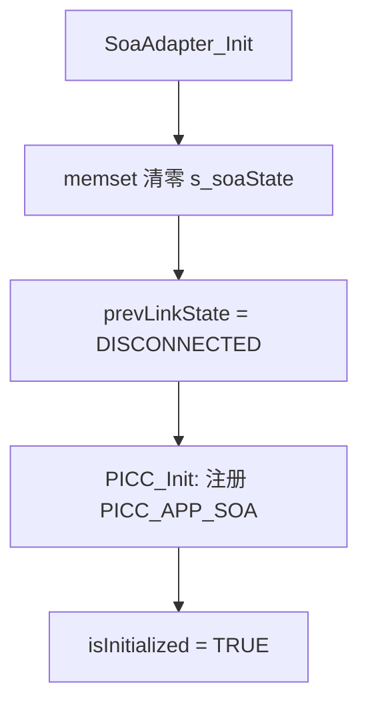
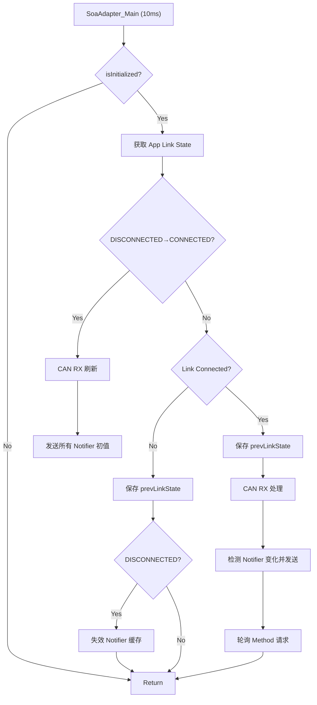
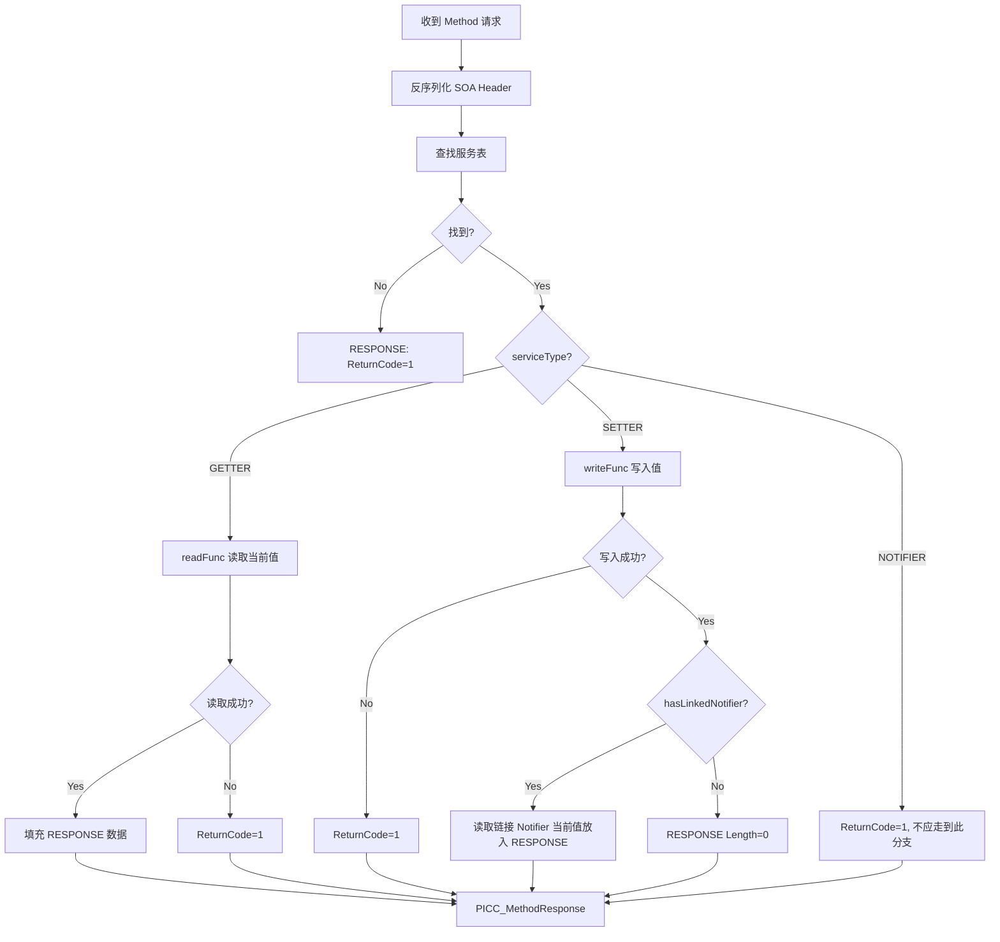

# SOA Adapter 模块设计文档

| 项目 | 内容 |
|------|------|
| 模块名称 | SOA Adapter |
| 版本 | 1.0 |
| 日期 | 2026-05-13 |
| 适用平台 | S32G399A M7 Core (FreeRTOS) |

---

## 1. 概述

SOA Adapter 是 M 核上的 SOA（面向服务架构）适配层模块，负责将 M 核内部的 CAN 信号数据桥接到 A 核的 SOA 服务框架。该模块通过 PICC 中间件经由 IPCF 共享内存通道与 A 核进行通信。

**数据流向：**
```
CAN Bus <-> DBC Structs <-> SOA Adapter <-> PICC API <-> IPCF <-> A-Core
```

---

## 2. 架构设计

### 2.1 模块组成

| 文件 | 职责 |
|------|------|
| `soa_adapter_main.h` | 公共接口声明 |
| `soa_adapter_main.c` | 核心逻辑实现（序列化、Notifier 发送、Method 处理、主循环） |
| `soa_adapter_cnf.h` | 配置定义（SOA Header 结构、服务矩阵、ID 宏） |
| `soa_adapter_cnf.c` | 配置实例化（信号读写函数、服务配置表） |

### 2.2 外部依赖

| 依赖模块 | 用途 |
|----------|------|
| `picc_api.h` | PICC 驱动公共 API（Init、SendEvent、MethodResponse、GetMethodData 等） |
| `FlexCAN_Ip_main.h` | CAN 收发接口 |
| `CANdbc_Generated.h` / `pwsm_cnf.h` | DBC 生成的 CAN 信号访问接口 / VehicleMode PWSM 状态访问 |
| `Platform.h` | 平台基础类型定义（uint8、uint16、sint8、boolean 等） |

### 2.3 PICC 注册配置

```c
localId    = 71 (0x47)    // M核 SOA Provider ID（ID 范围 71-80）
remoteId   = 76 (0x4C)    // A核 SOA Consumer ID
role       = PICC_ROLE_SERVER
channelId  = 2            // IPCF Channel 2
appIndex   = PICC_APP_SOA (7)
mode       = Polling      // methodHandler = NULL, eventHandler = NULL
```

---

## 3. 协议格式

### 3.1 双层协议结构

```
┌──────────────────┬──────────────────────────────────────┐
│  IPC 8B Header   │            IPC Payload               │
│ (PICC 层处理)     │         (SOA Adapter 处理)            │
│                  ├──────────────────┬───────────────────┤
│                  │  SOA 12B Header  │  SOA Actual Data  │
└──────────────────┴──────────────────┴───────────────────┘
```

### 3.2 SOA Header（12 字节，大端序）

| 字节偏移 | 字段 | 长度 | 说明 |
|---------|------|------|------|
| 0-1 | SOA_ServiceID | 2B | AP 服务 ID |
| 2-3 | SOA_MethodID | 2B | AP 方法/事件 ID |
| 4-5 | SOA_InstanceID | 2B | AP 实例 ID |
| 6-7 | SOA_SessionID | 2B | 会话 ID（Notifier 固定为 0，Getter/Setter 回显请求值） |
| 8-9 | SOA_ReturnCode | 2B | 返回码（0=成功，非 0=失败） |
| 10-11 | SOA_Length | 2B | 后续实际参数数据长度 |

**对应代码结构体：**
```c
typedef struct {
    uint16 SOA_ServiceID;
    uint16 SOA_MethodID;
    uint16 SOA_InstanceID;
    uint16 SOA_SessionID;
    uint16 SOA_ReturnCode;
    uint16 SOA_Length;
} SOA_Header_t;
```

### 3.3 IPCF 层固定 ID 映射

| SOA 业务类型 | IPCF 层 ID | IPCF MessageType |
|-------------|-----------|-----------------|
| 所有 Notifier/Event（M→A） | EventID = 3 | 0x09 (NOTIFICATION_WITHOUT_ACK) |
| 所有 Getter/Setter/Method（A→M→A） | MethodID = 1 | 0x05 (REQUEST) → 0x80 (RESPONSE) |

---

## 4. 服务矩阵

### 4.1 服务配置表

| 索引 | 服务接口名 | ServiceID | MethodID | InstanceID | 类型 | 数据源 | 大小 |
|------|-----------|-----------|----------|------------|------|--------|------|
| 0 | Atom_VCU_DriSpeedSt | 0x0001 | 0x8001 | 0x0001 | Notifier | `Can_Get_Rx_signal_VehicleSpeed()` | 2B |
| 1 | Atom_VCU_ParkingSt | 0x0002 | 0x5001 | 0x0001 | Getter | `Can_Get_Rx_signal_ParkingSts()` | 1B |
| 2 | Atom_VCU_HighVoltageBatterySt | 0x0003 | 0x5001 | 0x0001 | Getter | `Can_Get_Rx_signal_HighVoltageBatterySts()` | 2B |
| 3 | Atom_VCU_IgnitionSt | 0x0004 | 0x5001 | 0x0001 | Getter | `Can_Get_Rx_signal_IgnitionSts()` | 1B |
| 4 | Atom_BCM_VehicleMode | 0x0005 | 0x5001 | 0x0001 | Setter | `Pwsm_TstVehicleMode(&mode)` | 1B |
| 5 | Atom_BCM_VehicleModeSt | 0x0005 | 0x8001 | 0x0001 | Notifier | `Pwsm_TstVehicleMode(NULL)` | 1B |

### 4.2 Setter-Notifier 联动

Entry[4]（Setter）与 Entry[5]（Notifier）共享同一 ServiceID=0x0005：
- `hasLinkedNotifier = TRUE`
- `linkedNotifierIdx = 5`
- Setter 写入成功后，通过 Entry[5] 的 `readFunc` 读取当前值放入 RESPONSE

### 4.3 Notifier 索引表

```c
g_soaNotifierIndices[SOA_NOTIFIER_COUNT=2] = { 0, 5 };
// [0] → DriSpeedSt Notifier (ServiceTable[0])
// [1] → VehicleModeSt Notifier (ServiceTable[5])
```

---

## 5. 核心数据结构

### 5.1 服务配置条目

```c
typedef struct {
    uint16              SOA_ServiceID;
    uint16              SOA_MethodID;
    uint16              SOA_InstanceID;
    SOA_ServiceType_e   serviceType;       // NOTIFIER / GETTER / SETTER
    SOA_SignalReadFunc_t  readFunc;         // 读信号值函数指针
    SOA_SignalWriteFunc_t writeFunc;        // 写信号值函数指针
    uint16              SOA_EventGroupID;
    uint8               dataSize;
    boolean             hasLinkedNotifier;
    uint8               linkedNotifierIdx;
} SOA_ServiceConfig_t;
```

### 5.2 Notifier 变化检测缓存

```c
typedef struct {
    uint8   prevData[SOA_MAX_DATA_SIZE];  // 上次信号值
    uint16  prevLen;                       // 上次数据长度
    boolean isValid;                       // 首次读取后为 TRUE
} SOA_NotifierCache_t;
```

### 5.3 模块状态

```c
typedef struct {
    boolean             isInitialized;
    PICC_LinkState_e    prevLinkState;                      // 链路状态边沿检测
    SOA_NotifierCache_t notifCache[SOA_NOTIFIER_COUNT];     // 变化检测缓存
} SOA_AdapterState_t;
```

### 5.4 关键常量

| 宏 | 值 | 说明 |
|----|-----|------|
| `SOA_HEADER_SIZE` | 12 | SOA 协议头大小（字节） |
| `SOA_MAX_DATA_SIZE` | 256 | 单条消息最大 Payload |
| `SOA_MAX_MSG_SIZE` | 268 | Header + Data |
| `SOA_SERVICE_TABLE_COUNT` | 6 | 服务总数 |
| `SOA_NOTIFIER_COUNT` | 2 | Notifier 服务数 |

---

## 6. 功能流程

### 6.1 初始化流程 (`SoaAdapter_Init`)



**集成点：** 在 `EcuM_main_init.c` 的 `App_Init_All()` 中调用。

### 6.2 10ms 主循环 (`SoaAdapter_Main`)



### 6.3 Notifier 发送流程

#### 6.3.1 初值同步 (`SOA_SendAllNotifierInitValues`) — 组包发送
- **触发条件：** 链路从 DISCONNECTED 转换到 CONNECTED
- **行为：** 遍历 `g_soaNotifierIndices`，将每个 Notifier 的 SOA 报文（12B Header + Data）**拼接**到 `s_soaBatchBuf` 中，最后通过 **一次** `PICC_SendEvent()` 调用发送全部初值
- **组包格式：** `[SOA_Header(12B) + Data_1] [SOA_Header(12B) + Data_2] ... [SOA_Header(12B) + Data_N]`
- **同时：** 初始化变化检测缓存（`prevData`、`prevLen`、`isValid=TRUE`）
- **效率：** 将 N 次 PICC_SendEvent 调用减少为 1 次，降低 IPC 调用开销

#### 6.3.2 变化检测发送 (`SOA_CheckAndSendNotifiers`)
- **周期：** 10ms
- **行为：** 对每个 Notifier 读取当前值，与缓存比较（`memcmp`），有变化则发送并更新缓存

#### 6.3.3 单条 Notifier 构建 (`SOA_SendNotifier`)
1. 通过 `readFunc` 读取信号值到 `s_soaTxBuf[12..]`
2. 构建 SOA Header（SessionID=0, ReturnCode=0）
3. 序列化 Header 到 `s_soaTxBuf[0..11]`
4. 调用 `PICC_SendEvent(PICC_APP_SOA, EventID=3, buf, len, WITHOUT_ACK)`

#### 6.3.4 SOA 层组包机制 (SOA-Level Batching)

根据 SOA 协议规范要求：*多个 Event/Notifier 的 14 字节数据体可拼接成一个长 Payload 放在同一个底层报文内发送以提高效率*。

**当前实现范围：** 仅在初值同步阶段（`SOA_SendAllNotifierInitValues`）使用 SOA 层组包。周期变化检测发送（`SOA_CheckAndSendNotifiers`）仍然逐条发送。

**组包数据格式：**
```
┌────────────────────────────────┬────────────────────────────────┬─────┐
│ SOA Msg 1 (12B Hdr + Data)    │ SOA Msg 2 (12B Hdr + Data)    │ ... │
└────────────────────────────────┴────────────────────────────────┴─────┘
                    ↓ 整体作为一个 IPC Payload ↓
┌──────────────────┬──────────────────────────────────────────────┐
│  IPC 8B Header   │         Batched SOA Payload                 │
└──────────────────┴──────────────────────────────────────────────┘
```

**示例（当前 2 个 Notifier 初值同步）：**
```
SOA Msg 1: VehicleSpeed (14B = 12B header + 2B data)
  00 01  80 01  00 01  00 00  00 00  00 02  XX XX

SOA Msg 2: VehicleModeSt (13B = 12B header + 1B data)
  00 05  80 01  00 01  00 00  00 00  00 01  XX

→ 拼接后 PICC_SendEvent payload 长度 = 14 + 13 = 27 字节
```

**关键约束：**
- 组包总大小不得超过 `SOA_MAX_MSG_SIZE` (268B)
- A 核解析时需按 SOA_Header.SOA_Length 逐条解包
- 此组包仅为 SOA 层数据的拼接，底层 IPCF 堆叠（CRC使能位 + Counter + CRC16）由 PICC Stack 层独立处理

### 6.4 Method 请求处理流程

#### 6.4.1 轮询 (`SOA_PollMethodRequests`)
- 调用 `PICC_GetMethodData(PICC_APP_SOA, MethodID=1, ...)` 检查是否有待处理请求
- 收到数据后调用 `SOA_HandleMethodRequest()`

#### 6.4.2 请求处理 (`SOA_HandleMethodRequest`)



**关键规则：**
- RESPONSE 必须回显请求中的 `SOA_SessionID`
- Setter+Notifier 联动：写入成功后读取链接 Notifier 的当前值作为 RESPONSE 数据
- Setter 无联动：返回 `Length=0` 的空 RESPONSE

---

## 7. 链路状态管理

### 7.1 状态机

```
DISCONNECTED ──(A核 Server 回复连接确认)──> CONNECTED
CONNECTED ──(A核发送断开通知/心跳超时)──> DISCONNECTED
```

### 7.2 SOA Adapter 的链路感知行为

| 状态变迁 | SOA Adapter 行为 |
|---------|-----------------|
| DISCONNECTED → CONNECTED | 刷新 CAN RX → 发送所有 Notifier 初值 → 初始化变化检测缓存 |
| CONNECTED（稳态） | 正常执行 Notifier 变化检测 + Method 轮询 |
| → DISCONNECTED | 停止业务发送，失效所有 Notifier 缓存（`isValid=FALSE`） |
| 重新 CONNECTED | 再次发送全部 Notifier 初值（保证 A 核状态同步） |

### 7.3 M 核约束

- 建链前：**禁止**发送任何 SOA 业务数据
- 断链时：立即停止 SOA 业务报文发送
- 仅发送 `WITHOUT_ACK` 的 Event（M 核实时性约束）

---

## 8. 信号读写函数

### 8.1 Read 函数（Notifier + Getter）

| 函数 | 信号源 | 序列化 | 返回长度 |
|------|--------|--------|---------|
| `SOA_ReadVehicleSpeed` | `Can_Get_Rx_signal_VehicleSpeed()` | uint16 大端序 | 2B |
| `SOA_ReadWorkVehicleMode` | `Pwsm_TstVehicleMode(NULL)` | uint8 | 1B |
| `SOA_ReadParkingSts` | `Can_Get_Rx_signal_ParkingSts()` | uint8 | 1B |
| `SOA_ReadHighVoltageBatterySts` | `Can_Get_Rx_signal_HighVoltageBatterySts()` | uint16 大端序 | 2B |
| `SOA_ReadIgnitionSts` | `Can_Get_Rx_signal_IgnitionSts()` | uint8 | 1B |

### 8.2 Write 函数（Setter）

| 函数 | 信号目标 | 输入 | 返回 |
|------|---------|------|------|
| `SOA_WriteVehicleMode` | `Pwsm_TstVehicleMode(&mode)` | 1B uint8 | 0=成功, 1=失败 |

### 8.3 函数签名

```c
typedef uint16 (*SOA_SignalReadFunc_t)(uint8 *outBuf, uint16 maxLen);
typedef uint8  (*SOA_SignalWriteFunc_t)(const uint8 *inBuf, uint16 len);
```

---

## 9. 静态内存分配

| 变量 | 类型 | 大小 | 用途 |
|------|------|------|------|
| `s_soaState` | `SOA_AdapterState_t` | ~518B | 模块状态 + Notifier 缓存 |
| `s_soaTxBuf` | `uint8[]` | 268B | Notifier 逐条发送构建缓冲区 |
| `s_soaBatchBuf` | `uint8[]` | 268B | 初值同步组包缓冲区 |
| `s_methodRxBuf` | `uint8[]` | 268B | Method 请求接收缓冲区 |
| `s_methodRspBuf` | `uint8[]` | 268B | Method 响应构建缓冲区 |

> 总静态 RAM 占用约 **1.6 KB**

---

## 10. CAN 信号映射

### 10.1 CAN RX（接收）

| CAN ID | DBC 结构体 | SOA 使用的信号 |
|--------|-----------|---------------|
| 0x200 | `g_rx_Standard_200_Rx` | VehicleSpeed, ParkingSts, HighVoltageBatterySts, IgnitionSts |

### 10.2 CAN TX（发送）

| CAN ID | DBC 结构体 | SOA 使用的信号 |
|--------|-----------|---------------|
| 0x100 | `g_tx_Standard_100_Tx` | 当前 `SoaAdapter_Main()` 未调用 TX 处理；VehicleMode 由 PWSM 状态读写 |

---

## 11. 报文示例

### 11.1 Notifier: VehicleSpeed = 120 km/h (0x0078)

**SOA Payload (12+2=14 字节)：**
```
00 01  80 01  00 01  00 00  00 00  00 02  00 78
│ServiceID│MethodID│InstanceID│SessionID│ReturnCode│ Length │ Data │
```

**IPC 层调用：**
```c
PICC_SendEvent(PICC_APP_SOA, 3, payload, 14, PICC_EVENT_WITHOUT_ACK);
```

### 11.2 Getter: A 核请求 ParkingSts

**A→M 请求 SOA Payload：**
```
00 02  50 01  00 01  00 03  00 00  00 00
│ServiceID│MethodID│InstanceID│SessionID│ReturnCode│Length=0│
```

**M→A 响应 SOA Payload（ParkingSts=2）：**
```
00 02  50 01  00 01  00 03  00 00  00 01  02
│ServiceID│MethodID│InstanceID│SessionID│ReturnCode│Length=1│Data│
```

### 11.3 Setter: A 核设置 VehicleMode=1（有链接 Notifier）

**A→M 请求：**
```
00 05  50 01  00 01  00 05  00 00  00 01  01
```

**M→A 响应（通过链接 Notifier 读取 PWSM 当前值=1）：**
```
00 05  50 01  00 01  00 05  00 00  00 01  01
```

---

## 12. 集成说明

### 12.1 初始化顺序

```
1. FlexCAN_Process_Init()     // CAN 驱动初始化
2. PICC_PreOS_Init()          // IPCF 驱动 + PICC 基础设施
3. SoaAdapter_Init()          // SOA Adapter 注册（在 App_Init_All() 中）
4. vTaskStartScheduler()      // 启动 RTOS
```

### 12.2 周期任务

```
TASK_M0_10MS() {
    ...
    SoaAdapter_Main();    // 10ms 周期调用
    ...
}
```

---

## 13. 扩展指南

### 13.1 新增信号步骤

1. **`soa_adapter_cnf.h`**：添加 ServiceID/MethodID 宏、索引宏，更新 `SOA_SERVICE_TABLE_COUNT`
2. **`soa_adapter_cnf.c`**：实现 Read/Write 函数，在 `g_soaServiceTable` 添加条目
3. 如果是 Notifier：更新 `SOA_NOTIFIER_COUNT` 和 `g_soaNotifierIndices`
4. 如果是 Setter+Notifier 联动：设置 `hasLinkedNotifier=TRUE` 和 `linkedNotifierIdx`

### 13.2 设计约束

- M 核只发 `WITHOUT_ACK` Event
- M 核不支持同步等待，所有操作异步/轮询
- 建链前禁止发送业务数据
- 所有多字节字段使用大端序列化
- **初值同步使用 SOA 层组包**（多个 Notifier 拼接为一个 IPC Payload），周期变化检测逐条发送
